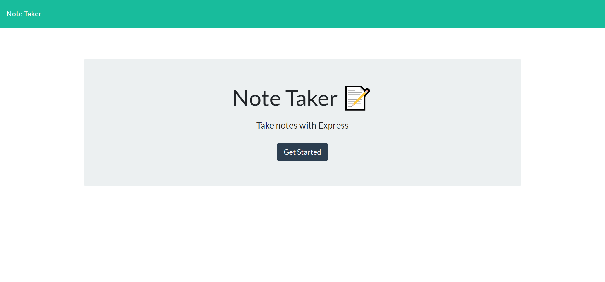

# Note Taker

## Description
This project uses an Express backend to write, save and delete notes.

## Table of Contents

* [Installation](#installation)
* [Usage](#usage)
* [License](#license)
* [Badges](#badges)
* [Contributing](#contributing)
* [Tests](#tests)
* [Questions](#questions)

## Installation
Express

## Usage
Write, save and delete notes.

## License
N/A

## Badges
N/A

## Contributing 
Feel free to contact me using the information in the Questions section.

## Tests
None

## Questions?
[jpanakkal22](https://github.com/jpanakkal22)

You can also contact me at josh_panakkal3122@hotmail.com

Heroku: https://obscure-hamlet-96073.herokuapp.com/notes
